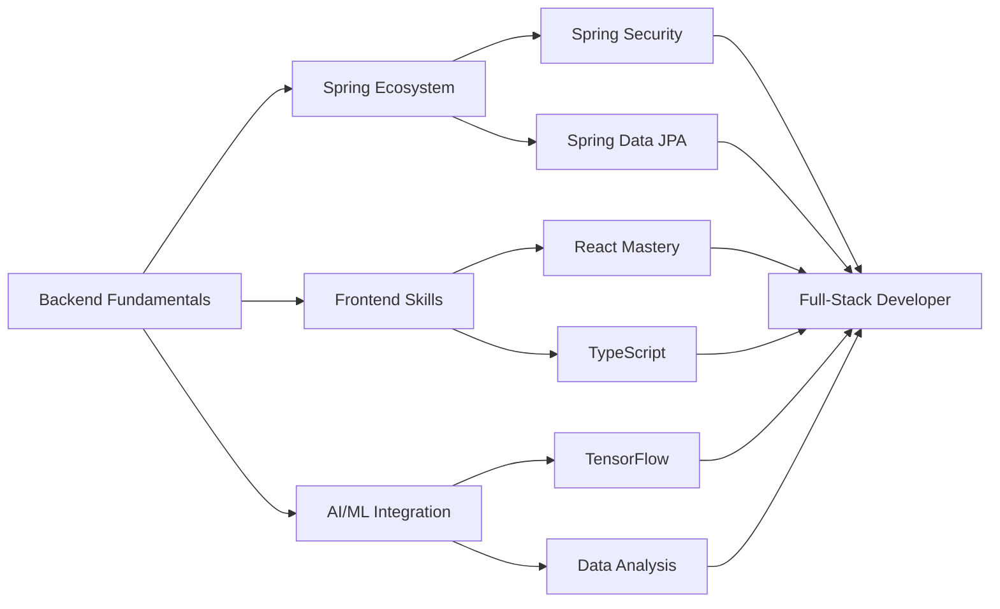

# 👋 안녕하세요, SooinDev입니다 / Hello, I'm SooinDev

<div align="center">
  
  
  
  [](https://git.io/typing-svg)

  > "Backends are the unsung heroes — invisible, yet indispensable."
  
  [](mailto:alwayswithsound@gmail.com)
  [](https://velog.io/@alwayswithsound/posts)
  [](https://alwayswithsound.tistory.com/)

  <p>
    <a href="#korean">🇰🇷 한국어</a> |
    <a href="#english">🇺🇸 English</a>
  </p>
</div>

---

<div id="korean">

## 💡 자기소개

- 🎓 **우송대학교** 컴퓨터공학과 재학
- 🔧 **Java**와 **Spring Boot**에 특화된 백엔드 개발자
- 🧠 **AI**, **웹 개발**, **데이터 분석**에 관심이 많음
- 🚀 프로젝트를 처음부터 끝까지 구현하는 것을 좋아함
- 💼 **백엔드 개발자**로서, 특히 **웹 서버 개발** 분야 진출 희망
- 🔥 현재 진행 중인 프로젝트:  
  - **AutoFinder** – 중고차 추천 웹 서비스 (Spring Boot + React + MySQL + Python)
  - **JobBridge** – AI기반 구인구직 매칭 서비스 (Spring Boot + React + MySQL + Python)

## 🛠️ 기술 스택

### ☕ 백엔드


### 🖥️ 프론트엔드


### 🧠 AI & 데이터 분석


### ☁️ 클라우드 & DevOps


### ⚙️ 협업 & 도구


## 📊 GitHub 통계

<div align="center">
  
  
</div>

<div align="center">
  
</div>

<div align="center">
  
</div>

## 🏆 GitHub 트로피

<div align="center">
  
</div>

## 📂 주요 프로젝트

<div align="center">

| 🌟 **프로젝트** | 📋 **설명** | 🛠️ **기술 스택** | 🔗 **링크** |
|:---:|:---:|:---:|:---:|
| **🚗 AutoFinder** | 중고차 추천 웹 서비스<br/>AI 기반 매칭 시스템 | Spring Boot, React<br/>MySQL, Python | [](https://github.com/SooinDev) |
| **💼 JobBridge** | AI 기반 구인구직<br/>매칭 서비스 | Spring Boot, React<br/>MySQL, Python | [](https://github.com/SooinDev) |

</div>

## 💡 학습 현황 & 성장

<div align="center">
  
  
  
</div>

### 📊 개발 시간 통계

<!--START_SECTION:waka-->


**🐱 My GitHub Data** 

> 📦 178.6 kB Used in GitHub's Storage 
 > 
> 🏆 463 Contributions in the Year 2025
 > 
> 🚫 Not Opted to Hire
 > 
> 📜 6 Public Repositories 
 > 
> 🔑 1 Private Repositories 
 > 
**I'm an Early 🐤** 

```text
🌞 Morning                349 commits         ████████░░░░░░░░░░░░░░░░░   32.74 % 
🌆 Daytime                203 commits         █████░░░░░░░░░░░░░░░░░░░░   19.04 % 
🌃 Evening                334 commits         ████████░░░░░░░░░░░░░░░░░   31.33 % 
🌙 Night                  180 commits         ████░░░░░░░░░░░░░░░░░░░░░   16.89 % 
```
📅 **I'm Most Productive on Thursday** 

```text
Monday                   121 commits         ███░░░░░░░░░░░░░░░░░░░░░░   11.35 % 
Tuesday                  83 commits          ██░░░░░░░░░░░░░░░░░░░░░░░   07.79 % 
Wednesday                273 commits         ██████░░░░░░░░░░░░░░░░░░░   25.61 % 
Thursday                 323 commits         ████████░░░░░░░░░░░░░░░░░   30.30 % 
Friday                   172 commits         ████░░░░░░░░░░░░░░░░░░░░░   16.14 % 
Saturday                 48 commits          █░░░░░░░░░░░░░░░░░░░░░░░░   04.50 % 
Sunday                   46 commits          █░░░░░░░░░░░░░░░░░░░░░░░░   04.32 % 
```


📊 **This Week I Spent My Time On** 

```text
💬 Programming Languages: 
No Activity Tracked This Week
```

**I Mostly Code in Python** 

```text
Python                   3 repos             █████████░░░░░░░░░░░░░░░░   37.50 % 
Java                     2 repos             ██████░░░░░░░░░░░░░░░░░░░   25.00 % 
Swift                    1 repo              ███░░░░░░░░░░░░░░░░░░░░░░   12.50 % 
Shell                    1 repo              ███░░░░░░░░░░░░░░░░░░░░░░   12.50 % 
JavaScript               1 repo              ███░░░░░░░░░░░░░░░░░░░░░░   12.50 % 
```


**Timeline**


 Last Updated on 28/05/2025 03:48:12 UTC
<!--END_SECTION:waka-->

### 📈 Technology Growth Roadmap



### 📖 Currently Learning
- **Spring Boot** advanced features and optimization
- **React & Next.js** frontend skill enhancement
- **AI/ML** backend service integration
- **Cloud Services** (AWS) utilization
- **DevOps** pipeline construction

### 🎯 2025 Goals
- [ ] **Spring Boot** mastery level achievement
- [ ] **Full-stack development** capabilities completion
- [ ] **Cloud-based** service deployment experience
- [ ] **Open source** project contribution start
- [ ] **Tech blog** regular posting

## 📚 Tech Blogs

<div align="center">

[](https://velog.io/@alwayswithsound/posts)
[](https://alwayswithsound.tistory.com/)

</div>

## 🔗 Contact

<div align="center">

[](mailto:alwayswithsound@gmail.com)
[](https://github.com/SooinDev)

**📫 Email**: `alwayswithsound@gmail.com`

</div>

<p align="right"><a href="#top">🔝 Back to top</a></p>

</div>

---

<div align="center">
  
  
  
  <sub>🚀 A passionate backend developer building the future with code | 코드로 미래를 만들어가는 열정적인 백엔드 개발자</sub>
  
  ---
  
  **"Code is poetry written in logic"** ✨
  
</div>
