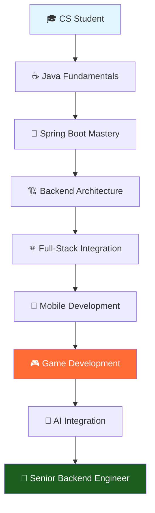

# SooinDev | Backend Engineer ☁️ 🛼

<div align="center">

[](https://git.io/typing-svg)


[](mailto:alwayswithsound@gmail.com)
[](https://velog.io/@alwayswithsound/posts)
[](https://alwayswithsound.tistory.com/)

</div>

---

## 👨‍💻 Professional Summary

```typescript
const sooInDev = {
    role: "Backend Engineer",
    location: "Seoul, South Korea",
    education: "Computer Science @ Woosong University",
    
    specializations: ["Java", "Spring Boot", "REST APIs", "System Design"],
    currentFocus: ["Microservices", "Clean Architecture", "AI Integration"],
    
    experience: {
        backend: ["Spring Boot", "Spring Security", "JPA/Hibernate", "MySQL"],
        frontend: ["React", "TypeScript", "Next.js"],
        mobile: ["Swift", "iOS Development", "SwiftUI"],
        ai_ml: ["Python", "TensorFlow", "Data Analysis"],
        tools: ["Git", "GitHub Actions", "Postman", "IntelliJ IDEA"]
    },
    
    philosophy: "Clean code is not written by following a set of rules. Clean code is written by programmers who care."
};
```

---

## 🛠️ Technology Arsenal

<div align="center">

### Core Backend Technologies


### Frontend & Full-Stack


### AI & Data Science


### Mobile Development


### DevOps & Tools


</div>

---

## 📊 Development Analytics

<!--START_SECTION:waka-->


**🐱 My GitHub Data** 

> 📦 201.2 kB Used in GitHub's Storage 
 > 
> 🚫 Not Opted to Hire
 > 
> 📜 13 Public Repositories 
 > 
> 🔑 2 Private Repositories 
 > 
**I'm an Early 🐤** 

```text
🌞 Morning                646 commits         ████████░░░░░░░░░░░░░░░░░   32.22 % 
🌆 Daytime                362 commits         █████░░░░░░░░░░░░░░░░░░░░   18.05 % 
🌃 Evening                601 commits         ███████░░░░░░░░░░░░░░░░░░   29.98 % 
🌙 Night                  396 commits         █████░░░░░░░░░░░░░░░░░░░░   19.75 % 
```
📅 **I'm Most Productive on Thursday** 

```text
Monday                   192 commits         ██░░░░░░░░░░░░░░░░░░░░░░░   09.58 % 
Tuesday                  214 commits         ███░░░░░░░░░░░░░░░░░░░░░░   10.67 % 
Wednesday                439 commits         █████░░░░░░░░░░░░░░░░░░░░   21.90 % 
Thursday                 628 commits         ████████░░░░░░░░░░░░░░░░░   31.32 % 
Friday                   287 commits         ████░░░░░░░░░░░░░░░░░░░░░   14.31 % 
Saturday                 86 commits          █░░░░░░░░░░░░░░░░░░░░░░░░   04.29 % 
Sunday                   159 commits         ██░░░░░░░░░░░░░░░░░░░░░░░   07.93 % 
```


📊 **This Week I Spent My Time On** 

```text
🕑︎ Time Zone: Asia/Seoul

💬 Programming Languages: 
No Activity Tracked This Week

🔥 Editors: 
No Activity Tracked This Week

🐱‍💻 Projects: 
No Activity Tracked This Week

💻 Operating System: 
No Activity Tracked This Week
```

**I Mostly Code in Java** 

```text
Java                     7 repos             ████████████░░░░░░░░░░░░░   46.67 % 
HTML                     2 repos             ███░░░░░░░░░░░░░░░░░░░░░░   13.33 % 
Swift                    2 repos             ███░░░░░░░░░░░░░░░░░░░░░░   13.33 % 
JavaScript               1 repo              ██░░░░░░░░░░░░░░░░░░░░░░░   06.67 % 
Shell                    1 repo              ██░░░░░░░░░░░░░░░░░░░░░░░   06.67 % 
```


**Timeline**


 Last Updated on 28/08/2025 01:59:23 UTC
<!--END_SECTION:waka-->

---

## 🎯 Featured Projects

<div align="center">

<table>
<tr>
<td width="33%">

### 🎮 Tetris Game
**Full-Stack Mobile Game Platform**

[](https://github.com/SooinDev/tetris-game)

```yaml
Tech Stack:
  Backend: Spring Boot, MySQL, JPA
  Frontend: iOS SwiftUI, Combine
  Architecture: MVVM, REST API
  
Features:
  - Native iOS Tetris gameplay
  - Multiple game modes
  - Real-time leaderboards
  - User statistics & achievements
  - Smooth 60fps animations
```

</td>
<td width="33%">

### 🚗 AutoFinder
**AI-Powered Used Car Platform**

[](https://github.com/SooinDev/AutoFinder.git)

```yaml
Tech Stack:
  Backend: Spring Boot, MySQL, JPA
  Frontend: React, TypeScript
  AI/ML: Python, TensorFlow
  
Features:
  - Intelligent car recommendation
  - Real-time price analysis
  - User preference learning
  - Advanced filtering system
```

</td>
<td width="33%">

### 💼 JobBridge
**AI-Based Job Matching Service**

[](https://github.com/SooinDev/jobbridge-backend)

```yaml
Tech Stack:
  Backend: Spring Boot, Spring Security
  Frontend: React, Next.js
  Database: MySQL, Redis
  AI/ML: Python, NLP
  
Features:
  - Smart job-candidate matching
  - Resume analysis & optimization
  - Real-time chat system
  - Advanced AI algorithms
```

</td>
</tr>
</table>

</div>

### 🎮 Latest: Tetris Game Highlights

<div align="center">

| Feature | Description | Technology |
|---------|-------------|------------|
| **🎯 Game Modes** | Classic, Marathon, Sprint gameplay | SwiftUI + Combine |
| **🏆 Leaderboards** | Global & mode-specific rankings | Spring Boot + MySQL |
| **📱 Native iOS** | 60fps smooth animations | SwiftUI + Core Animation |
| **🔄 Real-time Sync** | Live score updates & statistics | REST API + JSON |
| **🎨 Modern UI** | Intuitive touch controls & gestures | SwiftUI + Gesture Recognition |

[](https://github.com/SooinDev/tetris-game)
[](https://github.com/SooinDev/tetris-game/blob/main/backend/README.md)

</div>

---

## 📈 GitHub Analytics

<div align="center">


</div>

<div align="center">

</div>

<div align="center">

</div>

---

## 🏆 Achievements & Recognition

<div align="center">

</div>

<div align="center">


</div>

---

## 🚀 Professional Roadmap

<div align="center">



</div>

### 🎯 Current Objectives (2025)
- [x] **Full-Stack Mobile Game** - Completed Tetris with iOS + Spring Boot
- [ ] **Master Spring Boot Ecosystem** - Advanced Security, Testing, Microservices
- [ ] **System Design Excellence** - Scalable architecture patterns
- [ ] **AI-Driven Applications** - Integrate ML models with backend services
- [ ] **Mobile-Backend Integration** - Advanced iOS app connectivity
- [ ] **Open Source Contributions** - Contribute to major Spring projects

### 📚 Continuous Learning
- **Backend Engineering**: Spring Cloud, Kafka, Redis, Docker
- **System Design**: Microservices, Event-Driven Architecture
- **Mobile Development**: SwiftUI, Combine, Core Data, Game Engines
- **AI/ML Integration**: MLOps, Model Serving, Real-time Analytics

---

## 🌐 Professional Network

<div align="center">

[](https://velog.io/@alwayswithsound/posts)
[](https://alwayswithsound.tistory.com/)

**📧 Business Inquiries**: `alwayswithsound@gmail.com`

</div>

---

<div align="center">

### 💭 Philosophy

> *"The best code is no code at all. But when code is necessary, make it clean, maintainable, and elegant."*

**🎯 Available for Backend Engineering Opportunities | Open to Collaboration**

---


**⭐ Star this repository if you find it inspiring!**

</div>
