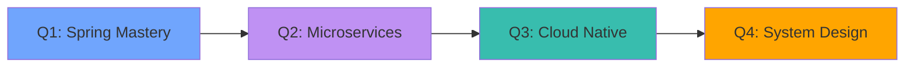

# 🚀 SooinDev

<div align="center">

[](https://git.io/typing-svg)

<br/>

[](mailto:alwayswithsound@gmail.com)
[](https://velog.io/@alwayswithsound/posts)
[](https://alwayswithsound.tistory.com/)

<br/>


</div>

---

## 👨‍💻 About Me


```typescript
const sooindev = {
  name: "SooinDev",
  role: "Backend Engineer 💻",
  location: "📍 Daejeon, South Korea",
  education: "🎓 Computer Science @ Woosong University",
  
  expertise: {
    backend: ["Spring", "Spring Boot", "MyBatis"],
    database: ["MySQL", "MariaDB", "Query Optimization"],
    server: ["Tomcat", "Linux", "AWS"],
    mobile: ["Flutter", "Dart"],
    tools: ["DBeaver", "Git", "IntelliJ IDEA"]
  },
  
  currentlyLearning: [
    "🔄 Microservices Architecture",
    "⚡ Performance Optimization",
    "☁️ Cloud-Native Development"
  ],
  
  motto: "Code with purpose, design with empathy 🌟"
};
```

<br clear="right"/>

---

## 🛠️ Tech Stack

<div align="center">

### 🎯 Backend Development


### 📱 Mobile Development


### 💾 Database & Cache


### 🌐 Frontend Technologies


### ⚙️ DevOps & Tools


</div>

---

## 🎨 Featured Projects

<div align="center">

<table>
<tr>
<td width="50%">

### 🌟 Irion Fan Site

[](https://yeti-125.com/)

Virtual streamer fan community platform

**Tech Stack:**
- `Spring Framework`
- `MyBatis`
- `MariaDB`
- `HTML`
- `CSS`
- `JS`
- `Tomcat 8.5.100`

**Features:**
- 🎭 Fan community platform
- 📝 Board system
- 👥 User management
- 🎨 Custom UI/UX

</td>
<td width="50%">

### 📱 CodeSlice

[](https://apps.apple.com/kr/app/codeslice/id6752849706)

Smart QR code generator for iOS

**Tech Stack:**
- `Flutter`
- `Dart`
- `iOS 13.0+`

**Features:**
- 📶 Wi-Fi QR code sharing
- 👤 Contact card generation
- 🔗 URL & Text to QR
- ✨ Minimal & intuitive design
- ⭐ 5.0 Rating on App Store

</td>
</tr>
<tr>
<td width="50%">

### 🚗 AutoFinder

[](https://github.com/SooinDev/AutoFinder)

AI-powered used car recommendation platform

**Tech Stack:**
- `Spring Framework`
- `MyBatis`
- `React`
- `Python`

**Features:**
- 🤖 AI recommendation engine
- 🔍 Advanced search filters
- 📊 Price analysis
- 💬 Review system

</td>
<td width="50%">

### 💼 JobBridge

[](https://github.com/SooinDev/jobbridge-backend)

Smart job matching service with NLP

**Tech Stack:**
- `Spring Boot`
- `MyBatis`
- `MySQL`
- `NLP`

**Features:**
- 🎯 Smart job matching
- 📄 Resume analysis
- 🔔 Job alerts
- 📊 Statistics dashboard

</td>
</tr>
</table>

</div>

---

## 📊 GitHub Statistics

<div align="center">


<br/><br/>


</div>

---

## 💼 Core Competencies

<div align="center">

| 🍃 Spring Ecosystem | 🗄️ Database Expertise | 🌐 Web Development | 📱 Mobile Development |
|:---:|:---:|:---:|:---:|
| Spring Framework | MyBatis Configuration | Apache Tomcat | Flutter |
| Spring Boot | Dynamic SQL | Server Configuration | Dart |
| Spring MVC | Result Mapping | Deployment | Cross-Platform |
| Spring Security | Transaction Management | Load Balancing | App Store Publishing |
| RESTful API Design | Query Optimization | JSP/Servlet | State Management |
| Layered Architecture | Index Design | JavaScript | UI/UX Design |
| MVC Pattern | Performance Tuning | AJAX | - |
| Dependency Injection | Stored Procedures | Responsive Design | - |

</div>

---

## 🎯 2025 Roadmap



<div align="center">

| Quarter | Focus Area | Goal |
|:-------:|:-----------|:-----|
| 🌱 **Q1** | Spring Framework Deep Dive | Advanced Spring features & patterns |
| 🔄 **Q2** | Microservices Architecture | Building distributed systems |
| ☁️ **Q3** | Cloud-Native Development | AWS, Docker, Kubernetes |
| 🎨 **Q4** | System Design & Architecture | Senior-level technical skills |

</div>

---

## 🏆 Development Environment

```yaml
💻 Primary Stack:
  Framework     : Spring Framework, Spring Boot
  ORM/Mapper    : MyBatis
  Database      : MySQL 8.0, MariaDB 10.x
  Web Server    : Apache Tomcat 8.5.100
  Language      : Java 1.8+, Dart
  
🛠️ Tools:
  IDE           : IntelliJ IDEA Ultimate, VS Code, Android Studio
  Database Tool : DBeaver Community
  Version Control: Git, GitHub
  Terminal      : iTerm2 with Dracula Theme
  
☁️ Infrastructure:
  Cloud         : AWS (EC2, RDS, S3)
  OS            : Linux (Ubuntu, CentOS), macOS
  CI/CD         : GitHub Actions
  
📱 Mobile:
  Framework     : Flutter
  Language      : Dart
  Platform      : iOS, Android (Cross-Platform)
  Distribution  : App Store
```

---

## 📈 Contribution Graph

<div align="center">

[](https://github.com/SooinDev)

</div>

---

## 🌟 Visitor Stats & Achievements

<div align="center">


<br/>

### 🏅 GitHub Trophies

[](https://github.com/ryo-ma/github-profile-trophy)

</div>

---

<div align="center">

### 💭 Developer Philosophy


<br/><br/>

> *"Building robust and scalable backend systems with Spring and MyBatis—one commit at a time."*

<br/>

**🚀 Open to Collaboration** • **💼 Available for Backend Engineering Opportunities** • **📧 Let's Connect!**

<br/>

[]()
[]()
[]()

<br/>

<sub>⭐ **Star my repositories if you find them useful!** ⭐</sub>

<br/>


</div>
