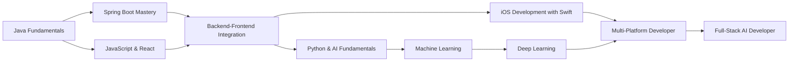

# 👋 Hello, I'm SooinDev / 안녕하세요, SooinDev입니다

<div align="center">
  
  
  
  [](https://git.io/typing-svg)

  > "Backends are the unsung heroes — invisible, yet indispensable."
  
  [](mailto:alwayswithsound@gmail.com)
  [](https://velog.io/@alwayswithsound/posts)
  [](https://alwayswithsound.tistory.com/)
  
</div>

---

<div id="english">

## 💡 About Me

- 🎓 **Computer Science student** at Woosong University
- 🔧 Backend developer specialized in **Java** and **Spring Boot**
- 🧠 Passionate about **AI**, **Web Development**, and **Data Analysis**
- 🚀 Enjoy building projects from the ground up
- 💼 Aiming to work as a **backend developer**, especially in **web server development**
- 🔥 Currently working on:  
  - **AutoFinder** – Used car recommendation web service (Spring Boot + React + MySQL + Python)
  - **JobBridge** – AI-based job matching service (Spring Boot + React + MySQL + Python)

## 🛠️ Tech Stack

### ☕ Backend


### 🖥️ Frontend


### 🧠 AI & Data Analysis


### 📱 Mobile Development


### ☁️ Cloud & DevOps


### ⚙️ Collaboration & Tools


## 📊 GitHub Statistics

<div align="center">
  
  
</div>

<div align="center">
  
</div>

<div align="center">
  
</div>

## 🏆 GitHub Trophies

<div align="center">
  
</div>

## 📂 Key Projects

<div align="center">

| 🌟 **Project** | 📋 **Description** | 🛠️ **Tech Stack** | 🔗 **Links** |
|:---:|:---:|:---:|:---:|
| **🚗 AutoFinder** | Used car recommendation<br/>web service with AI | Spring Boot, React<br/>MySQL, Python | [](https://github.com/SooinDev) |
| **💼 JobBridge** | AI-based job matching<br/>service platform | Spring Boot, React<br/>MySQL, Python | [](https://github.com/SooinDev) |

</div>

## 💡 Learning & Growth

<div align="center">
  
  
  
</div>

### 📊 Development Time Statistics

<!--START_SECTION:waka-->


**🐱 My GitHub Data** 

> 📦 178.9 kB Used in GitHub's Storage 
 > 
> 🏆 541 Contributions in the Year 2025
 > 
> 🚫 Not Opted to Hire
 > 
> 📜 6 Public Repositories 
 > 
> 🔑 1 Private Repositories 
 > 
**I'm an Early 🐤** 

```text
🌞 Morning                370 commits         ████████░░░░░░░░░░░░░░░░░   30.30 % 
🌆 Daytime                253 commits         █████░░░░░░░░░░░░░░░░░░░░   20.72 % 
🌃 Evening                395 commits         ████████░░░░░░░░░░░░░░░░░   32.35 % 
🌙 Night                  203 commits         ████░░░░░░░░░░░░░░░░░░░░░   16.63 % 
```
📅 **I'm Most Productive on Thursday** 

```text
Monday                   135 commits         ███░░░░░░░░░░░░░░░░░░░░░░   11.06 % 
Tuesday                  85 commits          ██░░░░░░░░░░░░░░░░░░░░░░░   06.96 % 
Wednesday                317 commits         ██████░░░░░░░░░░░░░░░░░░░   25.96 % 
Thursday                 399 commits         ████████░░░░░░░░░░░░░░░░░   32.68 % 
Friday                   185 commits         ████░░░░░░░░░░░░░░░░░░░░░   15.15 % 
Saturday                 48 commits          █░░░░░░░░░░░░░░░░░░░░░░░░   03.93 % 
Sunday                   52 commits          █░░░░░░░░░░░░░░░░░░░░░░░░   04.26 % 
```


📊 **This Week I Spent My Time On** 

```text
🕑︎ Time Zone: Asia/Seoul

💬 Programming Languages: 
CSS                      3 hrs 23 mins       ███████████░░░░░░░░░░░░░░   44.40 % 
JavaScript               2 hrs 8 mins        ███████░░░░░░░░░░░░░░░░░░   27.91 % 
Java                     2 hrs               ███████░░░░░░░░░░░░░░░░░░   26.29 % 
SQL                      4 mins              ░░░░░░░░░░░░░░░░░░░░░░░░░   00.89 % 
HTML                     1 min               ░░░░░░░░░░░░░░░░░░░░░░░░░   00.37 % 

🔥 Editors: 
IntelliJ IDEA            7 hrs 39 mins       █████████████████████████   100.00 % 

🐱‍💻 Projects: 
jobbridge-frontend       5 hrs 21 mins       ██████████████████░░░░░░░   70.13 % 
jobbridge-backend        1 hr 18 mins        ████░░░░░░░░░░░░░░░░░░░░░   17.15 % 
AutoFinder               36 mins             ██░░░░░░░░░░░░░░░░░░░░░░░   07.97 % 
PS                       20 mins             █░░░░░░░░░░░░░░░░░░░░░░░░   04.37 % 
voxdemo                  1 min               ░░░░░░░░░░░░░░░░░░░░░░░░░   00.37 % 

💻 Operating System: 
Mac                      7 hrs 39 mins       █████████████████████████   100.00 % 
```

**I Mostly Code in Java** 

```text
Java                     3 repos             █████████░░░░░░░░░░░░░░░░   37.50 % 
HTML                     1 repo              ███░░░░░░░░░░░░░░░░░░░░░░   12.50 % 
Swift                    1 repo              ███░░░░░░░░░░░░░░░░░░░░░░   12.50 % 
Shell                    1 repo              ███░░░░░░░░░░░░░░░░░░░░░░   12.50 % 
CSS                      1 repo              ███░░░░░░░░░░░░░░░░░░░░░░   12.50 % 
```


**Timeline**


 Last Updated on 30/05/2025 01:22:05 UTC
<!--END_SECTION:waka-->

### 📈 기술 성장 로드맵



### 📖 현재 학습 중
- **Java & Spring Boot** 백엔드 개발 심화
- **React** 프론트엔드 개발 역량 강화
- **Backend-Frontend 연동** 과정 학습
- **Swift** iOS 앱 개발 기초
- **API 설계** 및 **RESTful 서비스** 구축

### 🎯 단계별 학습 계획

#### 🥇 **1단계: Backend 마스터리 (현재 집중)**
- **Spring Boot** 심화 (Security, JPA, Testing)
- **RESTful API** 설계 및 최적화
- **데이터베이스** 설계 및 연동

#### 🥈 **2단계: Frontend 연동 완성**
- **JavaScript** ES6+ 문법 완벽 학습
- **React** 고급 패턴 및 상태 관리
- **Backend-Frontend** 완벽 연동

#### 🥉 **3단계: 모바일 개발 확장**
- **Swift** 기본 문법 및 iOS 개발
- **UIKit & SwiftUI** 마스터
- **iOS 앱과 Backend** 연동

#### 🏅 **4단계: AI 통합 개발자**
- **Python** 기초 및 데이터 처리
- **Machine Learning** (scikit-learn)
- **Deep Learning** (TensorFlow, PyTorch)
- **AI 모델과 Backend** 서비스 연동

### 🎯 2025년 목표
- [ ] **Spring Boot** 마스터 레벨 달성
- [ ] **React** 고급 개발 패턴 습득
- [ ] **Backend-Frontend** 완벽 연동 구현
- [ ] **Python & AI** 기초 완성
- [ ] **AI 통합 웹 서비스** 프로젝트 완성

## 📚 기술 블로그

<div align="center">

[](https://velog.io/@alwayswithsound/posts)
[](https://alwayswithsound.tistory.com/)

</div>

## 🔗 연락처

<div align="center">

[](mailto:alwayswithsound@gmail.com)
[](https://github.com/SooinDev)

**📫 Email**: `alwayswithsound@gmail.com`

</div>

<p align="right"><a href="#top">🔝 맨 위로</a></p>

</div>

---

<div align="center">
  
  
  
  <sub>🚀 A passionate backend developer building the future with code | 코드로 미래를 만들어가는 열정적인 백엔드 개발자</sub>
  
  ---
  
  **"Code is poetry written in logic"** ✨
  
</div>
