# SooinDev | Backend Engineer ☁️ 🛼

<div align="center">

[](https://git.io/typing-svg)


[](mailto:alwayswithsound@gmail.com)
[](https://velog.io/@alwayswithsound/posts)
[](https://alwayswithsound.tistory.com/)

</div>

---

## 👨‍💻 Professional Summary

```typescript
const sooInDev = {
    role: "Backend Engineer",
    location: "Seoul, South Korea",
    education: "Computer Science @ Woosong University",
    
    specializations: ["Java", "Spring Boot", "REST APIs", "System Design"],
    currentFocus: ["Microservices", "Clean Architecture", "AI Integration"],
    
    experience: {
        backend: ["Spring Boot", "Spring Security", "JPA/Hibernate", "MySQL"],
        frontend: ["React", "TypeScript", "Next.js"],
        mobile: ["Swift", "iOS Development"],
        ai_ml: ["Python", "TensorFlow", "Data Analysis"],
        tools: ["Git", "GitHub Actions", "Postman", "IntelliJ IDEA"]
    },
    
    philosophy: "Clean code is not written by following a set of rules. Clean code is written by programmers who care."
};
```

---

## 🛠️ Technology Arsenal

<div align="center">

### Core Backend Technologies


### Frontend & Full-Stack


### AI & Data Science


### Mobile Development


### DevOps & Tools


</div>

---

## 📊 Development Analytics

<!--START_SECTION:waka-->


**🐱 My GitHub Data** 

> 📦 179.2 kB Used in GitHub's Storage 
 > 
> 🏆 648 Contributions in the Year 2025
 > 
> 🚫 Not Opted to Hire
 > 
> 📜 9 Public Repositories 
 > 
> 🔑 1 Private Repositories 
 > 
**I'm a Night 🦉** 

```text
🌞 Morning                371 commits         ███████░░░░░░░░░░░░░░░░░░   27.85 % 
🌆 Daytime                275 commits         █████░░░░░░░░░░░░░░░░░░░░   20.65 % 
🌃 Evening                431 commits         ████████░░░░░░░░░░░░░░░░░   32.36 % 
🌙 Night                  255 commits         █████░░░░░░░░░░░░░░░░░░░░   19.14 % 
```
📅 **I'm Most Productive on Thursday** 

```text
Monday                   135 commits         ███░░░░░░░░░░░░░░░░░░░░░░   10.14 % 
Tuesday                  91 commits          ██░░░░░░░░░░░░░░░░░░░░░░░   06.83 % 
Wednesday                339 commits         ██████░░░░░░░░░░░░░░░░░░░   25.45 % 
Thursday                 460 commits         █████████░░░░░░░░░░░░░░░░   34.53 % 
Friday                   204 commits         ████░░░░░░░░░░░░░░░░░░░░░   15.32 % 
Saturday                 51 commits          █░░░░░░░░░░░░░░░░░░░░░░░░   03.83 % 
Sunday                   52 commits          █░░░░░░░░░░░░░░░░░░░░░░░░   03.90 % 
```


📊 **This Week I Spent My Time On** 

```text
🕑︎ Time Zone: Asia/Seoul

💬 Programming Languages: 
Java                     16 hrs 13 mins      ███████████████░░░░░░░░░░   60.31 % 
Swift                    3 hrs 11 mins       ███░░░░░░░░░░░░░░░░░░░░░░   11.83 % 
Python                   2 hrs 24 mins       ██░░░░░░░░░░░░░░░░░░░░░░░   08.98 % 
C                        1 hr 54 mins        ██░░░░░░░░░░░░░░░░░░░░░░░   07.11 % 
JavaScript               1 hr 12 mins        █░░░░░░░░░░░░░░░░░░░░░░░░   04.47 % 

🔥 Editors: 
IntelliJ IDEA            18 hrs 10 mins      █████████████████░░░░░░░░   67.52 % 
Xcode                    3 hrs 15 mins       ███░░░░░░░░░░░░░░░░░░░░░░   12.09 % 
CLion                    2 hrs 30 mins       ██░░░░░░░░░░░░░░░░░░░░░░░   09.32 % 
PyCharm                  2 hrs 10 mins       ██░░░░░░░░░░░░░░░░░░░░░░░   08.10 % 
Zoom                     48 mins             █░░░░░░░░░░░░░░░░░░░░░░░░   02.97 % 

🐱‍💻 Projects: 
kata                     8 hrs 31 mins       ████████░░░░░░░░░░░░░░░░░   31.68 % 
AutoFinder               6 hrs 16 mins       ██████░░░░░░░░░░░░░░░░░░░   23.34 % 
PS                       4 hrs 55 mins       █████░░░░░░░░░░░░░░░░░░░░   18.30 % 
untitled                 2 hrs 21 mins       ██░░░░░░░░░░░░░░░░░░░░░░░   08.73 % 
jobbridge-frontend       54 mins             █░░░░░░░░░░░░░░░░░░░░░░░░   03.40 % 

💻 Operating System: 
Mac                      26 hrs 54 mins      █████████████████████████   100.00 % 
```

**I Mostly Code in Java** 

```text
Java                     5 repos             ███████████░░░░░░░░░░░░░░   45.45 % 
Swift                    2 repos             █████░░░░░░░░░░░░░░░░░░░░   18.18 % 
HTML                     1 repo              ██░░░░░░░░░░░░░░░░░░░░░░░   09.09 % 
Shell                    1 repo              ██░░░░░░░░░░░░░░░░░░░░░░░   09.09 % 
CSS                      1 repo              ██░░░░░░░░░░░░░░░░░░░░░░░   09.09 % 
```


**Timeline**


 Last Updated on 05/06/2025 17:26:59 UTC
<!--END_SECTION:waka-->

---

## 🎯 Featured Projects

<div align="center">

<table>
<tr>
<td width="50%">

### 🚗 AutoFinder
**AI-Powered Used Car Recommendation Platform**

[](https://github.com/SooinDev/AutoFinder.git)

```yaml
Tech Stack:
  Backend: Spring Boot, MySQL, JPA
  Frontend: React, TypeScript
  AI/ML: Python, TensorFlow
  
Features:
  - Intelligent car recommendation engine
  - Real-time price analysis
  - User preference learning
  - Responsive web design
```

</td>
<td width="50%">

### 💼 JobBridge
**AI-Based Job Matching Service**

[](https://github.com/SooinDev/jobbridge-backend)

```yaml
Tech Stack:
  Backend: Spring Boot, Spring Security
  Frontend: React, Next.js
  Database: MySQL, Redis
  AI/ML: Python, NLP
  
Features:
  - Smart job-candidate matching
  - Resume analysis & optimization
  - Real-time chat system
  - Advanced filtering algorithms
```

</td>
</tr>
</table>

</div>

---

## 📈 GitHub Analytics

<div align="center">


</div>

<div align="center">

</div>

<div align="center">

</div>

---

## 🏆 Achievements & Recognition

<div align="center">

</div>

<div align="center">


</div>

---

## 🚀 Professional Roadmap

```mermaid
graph TD
    A[🎓 CS Student] --> B[☕ Java Fundamentals]
    B --> C[🍃 Spring Boot Mastery]
    C --> D[🏗️ Backend Architecture]
    D --> E[⚛️ Full-Stack Integration]
    E --> F[📱 Mobile Development]
    F --> G[🤖 AI Integration]
    G --> H[🏢 Senior Backend Engineer]
    
    style A fill:#e1f5fe
    style H fill:#1b5e20,color:#fff
```

<div align="center">



</div>

### 🎯 Current Objectives (2025)
- [ ] **Master Spring Boot Ecosystem** - Advanced Security, Testing, Microservices
- [ ] **System Design Excellence** - Scalable architecture patterns
- [ ] **AI-Driven Applications** - Integrate ML models with backend services
- [ ] **Mobile-Backend Integration** - Seamless iOS app connectivity
- [ ] **Open Source Contributions** - Contribute to major Spring projects

### 📚 Continuous Learning
- **Backend Engineering**: Spring Cloud, Kafka, Redis, Docker
- **System Design**: Microservices, Event-Driven Architecture
- **AI/ML Integration**: MLOps, Model Serving, Real-time Analytics
- **Mobile Development**: SwiftUI, Combine, Core Data

---

## 🌐 Professional Network

<div align="center">

[](https://velog.io/@alwayswithsound/posts)
[](https://alwayswithsound.tistory.com/)

**📧 Business Inquiries**: `alwayswithsound@gmail.com`

</div>

---

<div align="center">

### 💭 Philosophy

> *"The best code is no code at all. But when code is necessary, make it clean, maintainable, and elegant."*

**🎯 Available for Backend Engineering Opportunities | Open to Collaboration**

---


**⭐ Star this repository if you find it inspiring!**

</div>
